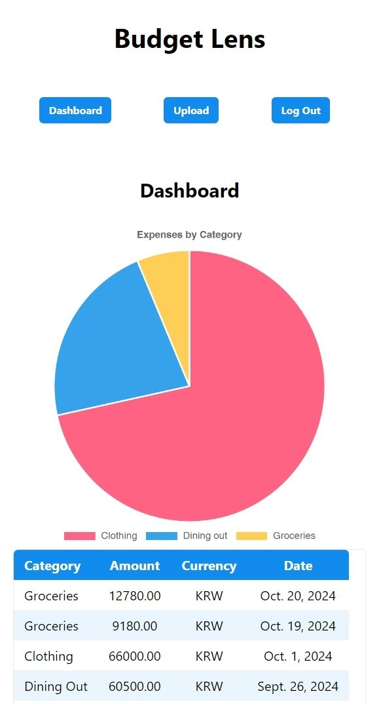
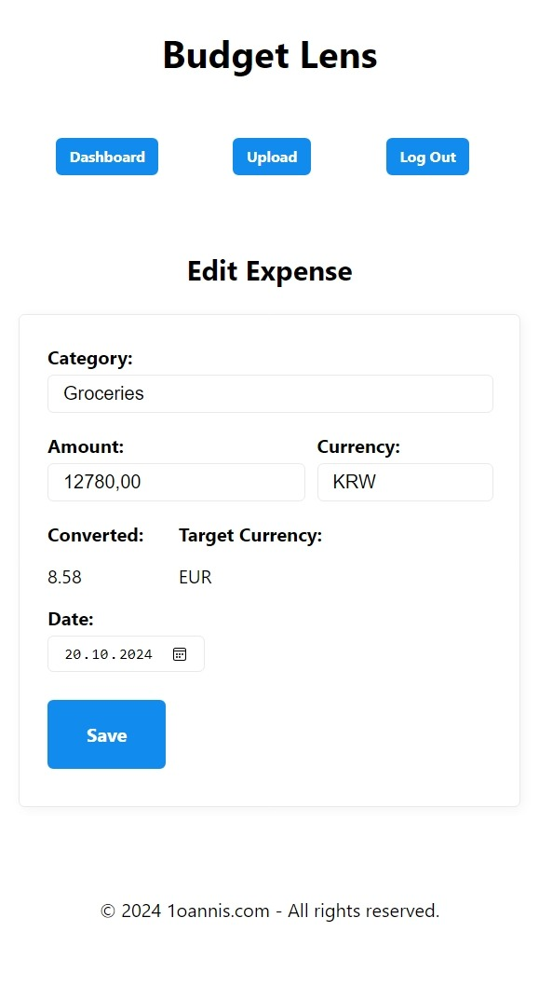
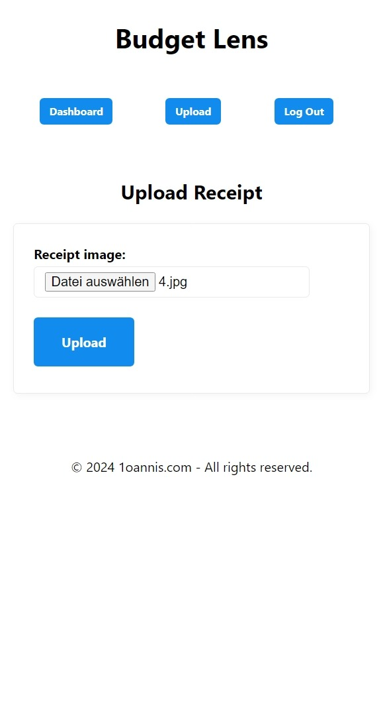
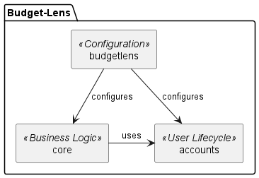
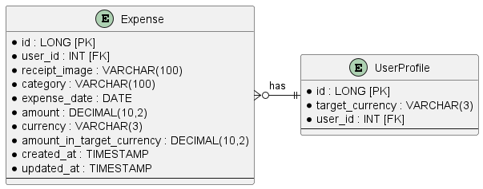
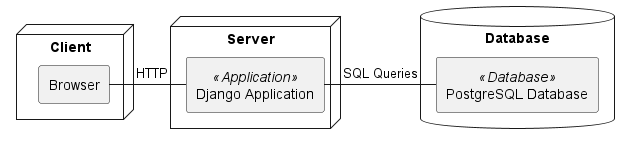

# BudgetLens
>
> [!NOTE]
> Copyright 2024 - present [Ioannis Theodosiadis](mailto:ioannis@seoultech.ac.kr), SEOULTECH University
>
> This program is free software: you can redistribute it and/or modify
> it under the terms of the GNU General Public License as published by
> the Free Software Foundation, either version 3 of the License, or
> at your option any later version
>
> This program is distributed in the hope that it will be useful
> but WITHOUT ANY WARRANTY; without even the implied warranty of
> MERCHANTABILITY or FITNESS FOR A PARTICULAR PURPOSE.  See the
> GNU General Public License for more details
>
> You should have received a copy of the GNU General Public License
> along with this program. If not, see <https://www.gnu.org/licenses/>
>
> Preview this Markdown file in VS Code with <kbd>Ctrl</kbd> + <kbd>Shift</kbd> + <kbd>V</kbd>

---

BudgetLens is the open-source receipt scanner and expense tracker made for self-hosting. Receipts in any language and currency can be uploaded in a matter of seconds. The AI analyzes the picture and immediately adds it to your expenses. You can overview your expenses on the dashboard. The UI is very simple and self-explanatory but can be further improved by fellow contributors. Find out more on [how to contribute](#how-to-contribute).

---

|  |  |  |
|:-------------------------------------------------------:|:------------------------------------------------------------:|:-------------------------------------------------:|

## Contents

- [Architecture](#architecture)
- [Local Installation](#local-installation)
- [Initialization](#initialization)
- [Application Start](#application-start)
- [How to Contribute](#how-to-contribute)
- [Liscence](#liscence)

## Architecture

- This is a [Django](https://www.djangoproject.com/) App using the [OpenAI API](https://openai.com/index/openai-api/) for image recognition and categorization and the [Open Exchange Rates API](https://openexchangerates.org/) for currency conversion.
- The data is stored in a [PostgreSQL](https://www.postgresql.org/) DB and images are stored on the Linux filesystem.
- The UI is made with the static build-in templating engine of Django.

### Components

Typical for Django we have different components. As this is a simple and robust application, I kept it to the minimum amount. There is the default component budgetlens holding the configurations, the core including all the business logic and the accounts component handling the user lifecycle:



### Entity Relationship Model

Essentially there is only one entity and one extension for the Django user:



### Deployment

The deployment architecture is kept as simple as possible with one external DB and the Application Server:



## Local Installation
>
> [!NOTE]
> A [Python](https://www.python.org/downloads/) installation of the version 3.12 is required to run this project.

1. First create a python virtual environment in the root directory:

    ```PowerShell
    python -m venv .venv
    ```

1. Activate the venv:

    - Windows:

        ```PowerShell
        .\venv\Script\activate
        ```

    - Mac / Linux:

        ```bash
        source myenv/bin/activate
        ```

1. Upgrade pip if necessary:

    ```PowerShell
    python -m pip install --upgrade pip
    ```

1. Install the required dependencies:

    ```PowerShell
    pip install -r requirements.txt
    ```

## Initialization

After the basic installation, you have to initialize the Django App and DB properly. First we need to start the DB. In order to get started easy, I have provided a docker compose script in `.extras/compose` for the DB.

> [!NOTE]
> This step requires at minimum a [Docker Engine](https://docs.docker.com/engine/install) installation.

1. **Start the DB:**

    In a terminal execute the following prompts.

    ```PowerShell
    cd .\.extras\compose
    ```

    ```PowerShell
    docker compose up
    ```

1. **Setup environment variables:**

    In another terminal window execute the following steps.

    - You need to create a `.env` file in the `budgetlens` directory.

        ```PowerShell
        cd budgetlens
        ```

        - Windows:

            ```PowerShell
            New-Item -ItemType File -Name ".env"
            ```

        - Mac / Linux:

            ```PowerShell
            touch .env
            ```

    - Within this file you have to specify the following env variables:

        ```dotenv
        DB_NAME=budgetlens
        DB_USER=postgres
        DB_PASSWORD=postgres
        DB_HOST=127.0.0.1
        DB_PORT=5432

        ALLOWED_HOSTS=127.0.0.1,localhost

        OPENAI_API_KEY={insert your own API key here}
        OPEN_EXCHANGE_RATES_API_KEY={insert your own API key here}
        ```

        > ❗**Important**
        >
        > Keep in mind, these are only example variables. Never ever upload or expose them to the public.
        > Be especially careful with API keys.

1. **Migrate the DB:**

    > ❗**Important**
    >
    > The Python `venv` has to be activated for these steps.

    In another terminal window execute the following prompts.

    ```PowerShell
    cd budgetlens
    ```

    ```PowerShell
    python manage.py makemigrations
    ```

    ```PowerShell
    python manage.py migrate
    ```

1. **Create a superuser for Django Admin:**

    Try not to forget the credentials you will create.

    ```PowerShell
    python manage.py createsuperuser
    ```

## Application Start

Now that we are all setup, it is time to start the application.

```PowerShell
python manage.py runserver
```

By default you can find the login screeen at [localhost:8000](http://localhost:8000/).

## How to Contribute

- Fork the repository to your own GitHub account.
- Clone the forked repository to your local machine.
- Create a new branch for your feature or bugfix.
- Make your changes in the new branch.
- Ensure your code follows the project's coding standards and passes all tests.
- Commit your changes with clear and concise commit messages.
- Push your branch to your forked repository on GitHub.
- Open a pull request from your branch to the main repository.
- Provide a detailed description of your changes in the pull request.
- Participate in the code review process and make any requested changes.
- Once your pull request is approved, it will be merged into the main repository.

## Liscence

This project is licensed under the [GNU General Public License v3.0](./LICENSE).